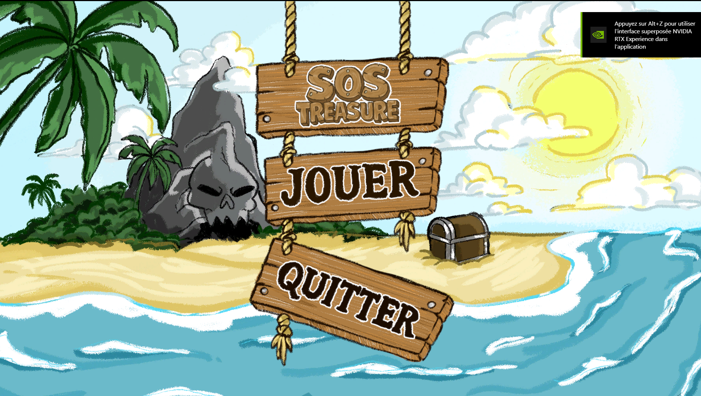
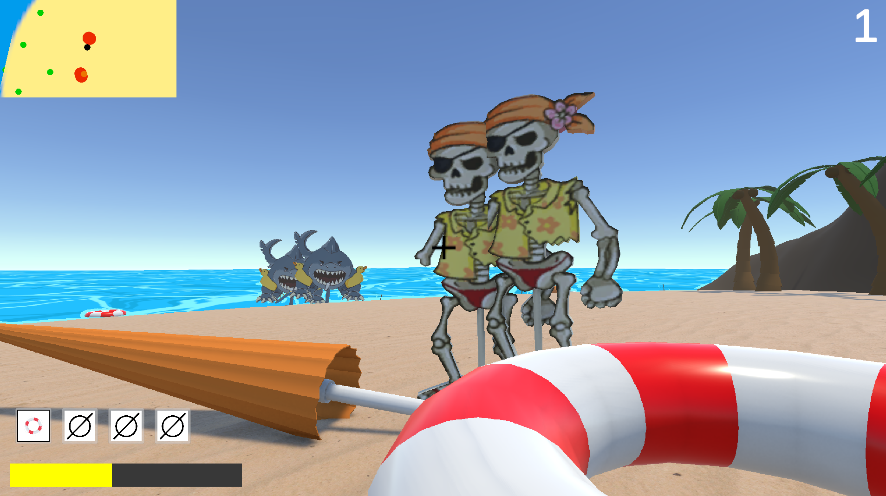
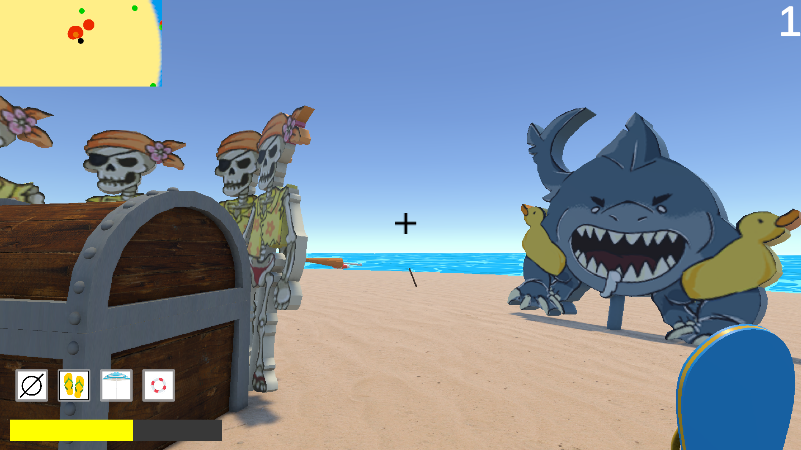
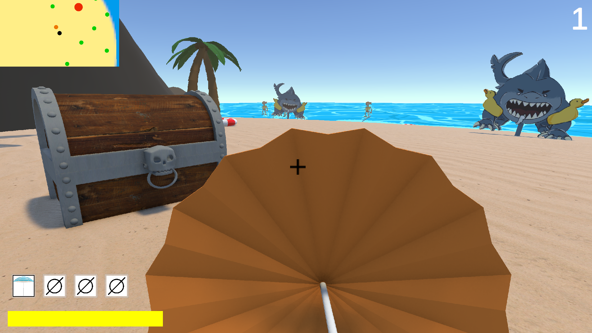

# SOS Treasure 

Game submitted for the Godmofather Game Jam 2025 at IIM Digital School.

Defend the treasure chests from a sea monster’s plank invasion on a small island, using whatever you can scavenge from the beach!

__Itch.io__: https://gabcvue.itch.io/sostreasure

# Screenshots

# Credits

- _Producer / Sound Designer_ : Gabriel Cuvillier
- _Game Designers_ : Jade Cauchoix, Liam Godart, Nicolas Sedano
- _Game Programmers_ : Axel Brissy, Chloé Mathias
- _Game Artists_ : Romain Oliveira, Gabrielle Araminthe

_3rd-party Music / Sound assets_: 

- Revival of Africa - Royalty Free - YouTube
- "Seagull cry" / "Seashore waves" / "Siamang monkey haul" / "Marée basse Sable d'Olonne" /  "Wooden cracks" - Royalty Free samples on Freesound

Made with Unity.

# License

__CC BY-NC-SA__ (Attribution, NonCommercial, ShareAlike)

